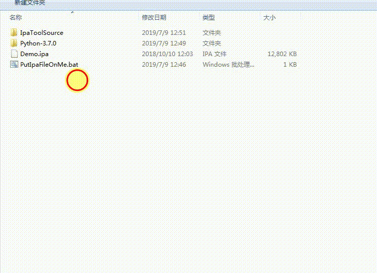

# AnalyzeInfoPlistInIpa
用于从苹果的Ipa包中解析info.plist出来。

使用方法可见： 

如需要解析特殊info.plist文件，请看源码。
源码提供了可以查看其他info.plist的方式.
    
    '''获取主infoplist与额外的infoplist 
       需要传入相对于ipa的infoplist路径，如： 
       \Demo.bundle\demoinfo.plist
    '''
    def analyze_ipamainplist_with_plistlib(ipa_path,otherInfoPlist_name):